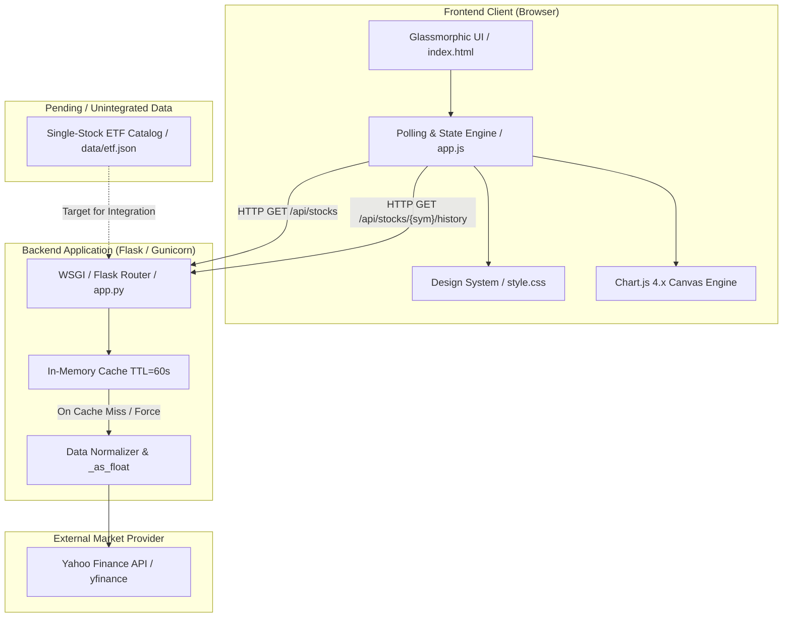
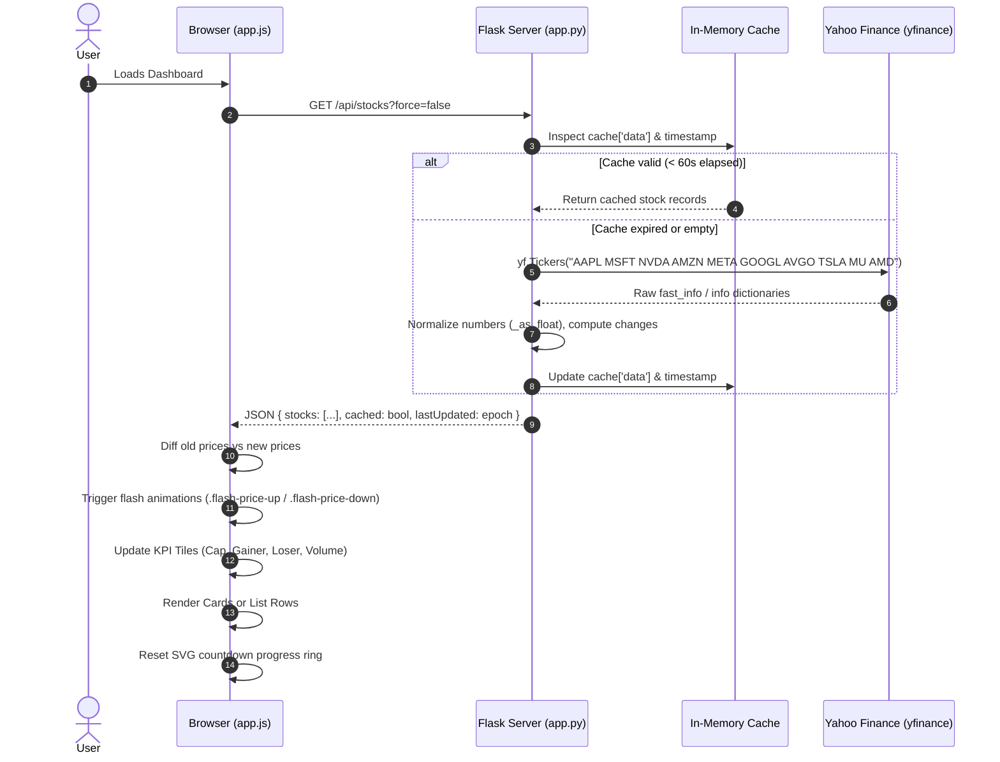

# Reverse-Engineered System Specification: Nasdaq-10 Stock Dashboard

**Document Version:** 1.0.0  
**Audit Date:** October 2026  
**Target Repository:** [`nasdaq-stock-dashboard`](file:///Users/katharine/Antigravity/workspace/nasdaq-stock-dashboard)  
**Primary Authors:** Reverse-Engineered via Antigravity Codebase Audit  

---

## 1. Executive Summary & Purpose

The **Nasdaq-10 Stock Dashboard** is a real-time market monitoring and analytics web application designed to track performance metrics, daily trading ranges, valuation highlights, and 5-day historical trends for top US equities traded on the Nasdaq stock exchange.

### Core Value Proposition
- **High-Density Market Telemetry:** Delivers instantaneous visibility into key metrics: Last Price, Price Change ($ and %), Day Range (visualized via low/high slider), Trading Volume, and Market Capitalization.
- **Executive KPI Summaries:** Aggregates combined market capitalization across all tracked equities and highlights the session's Top Gainer, Top Loser, and Volume Leader.
- **Glassmorphic Dark UI:** Utilizes modern CSS backdrop filters, custom typography, micro-interactions, and visual price update flashes (green/red glowing pulses).
- **Interactive Technical Analysis:** Offers deep-dive modals featuring 5-day hourly candlestick trend lines rendered smoothly with Chart.js.
- **Resilient Polling Engine:** Pairs a client-side circular countdown timer with an in-memory caching tier on the backend to avoid upstream rate limits.

---

## 2. System Architecture & Topology

The system operates as a decoupled single-tier web service where a lightweight Python Flask backend acts as an API gateway, static file server, and caching proxy in front of Yahoo Finance.

### 2.1 Component Architecture Diagram



### 2.2 Sequence Diagram: Quote Fetch & Polling Cycle



---

## 3. Technology Stack Matrix

| Layer | Component | Version / Specification | Rationale & Usage |
| :--- | :--- | :--- | :--- |
| **Backend Runtime** | Python | 3.3+ (Active: 3.14) | Core language for server logic and data transformation. |
| **Web Framework** | Flask | `>= 3.0.0` | Minimalist micro-framework providing REST endpoints and static file serving. |
| **CORS Middleware** | Flask-CORS | `>= 4.0.0` | Enables Cross-Origin Resource Sharing during local development. |
| **Market Data SDK** | yfinance | `>= 1.4.0` | Asynchronous retrieval of real-time and historical equity quotes from Yahoo Finance. |
| **WSGI Server** | Gunicorn | Latest | Production WSGI HTTP server configured for Render / cloud deployment. |
| **Frontend Core** | Semantic HTML5 | W3C Standard | Accessible semantic DOM structure (`header`, `main`, `section`, `footer`, `canvas`). |
| **Frontend Styling**| Vanilla CSS3 | Custom Design Tokens | Glassmorphism, CSS Grid, Flexbox, custom animations, zero framework overhead. |
| **Client Scripting**| Vanilla JavaScript | ES6+ | State management, DOM diffing, SVG progress ring animation, polling timer. |
| **Charting Engine** | Chart.js | `v4.x` (CDN via jsDelivr)| Renders 5-day hourly smooth spline line charts with vertical alpha gradients. |
| **Iconography** | FontAwesome | `v6.4.0` (CDN Cloudflare) | Financial indicators, direction chevrons, search icons, action buttons. |
| **Typography** | Google Fonts | `Outfit` & `Inter` | `Outfit` (display/headers) and `Inter` (data readouts and body text). |

---

## 4. Reverse-Engineered Functional Requirements

### FR-1: Top 10 Equities Tracking
* **Description:** The system must actively track and report telemetry for exactly 10 major Nasdaq-listed technology equities.
* **Tracked Constituents (Current Code):**
  1. `AAPL` — Apple Inc.
  2. `MSFT` — Microsoft Corporation
  3. `NVDA` — NVIDIA Corporation
  4. `AMZN` — Amazon.com, Inc.
  5. `META` — Meta Platforms, Inc.
  6. `GOOGL` — Alphabet Inc.
  7. `AVGO` — Broadcom Inc.
  8. `TSLA` — Tesla, Inc.
  9. `MU` — Micron Technology Inc.
  10. `AMD` — Advanced Micro Devices Inc.
* *(Note: Refer to Section 9 for documentation discrepancy regarding `COST` and `NFLX`)*.

### FR-2: Executive Summary Highlight Tiles
* **Combined Valuation:** Summation of all 10 equities' market caps displayed in Trillions (`$X.XX T`) or Billions (`$X.XX B`).
* **Top Gainer:** Identification and highlighting of the stock with the highest positive percentage change.
* **Top Loser:** Identification and highlighting of the stock with the largest negative percentage change.
* **Volume Leader:** Identification and formatting of the equity with the highest session share volume.

### FR-3: Dual-Mode Interactive View Toggling
* **Grid View (Default):** Renders responsive CSS glassmorphic cards. Each card displays:
  - Ticker badge and full corporate name.
  - Directional trend pill with icon (`fa-arrow-trend-up` / `fa-arrow-trend-down`) and signed percentage.
  - Large price display with tick flash integration.
  - Visual daily range indicator (horizontal slider bar with dynamic marker positioned at `(price - low) / (high - low) * 100%`).
  - Market Cap and Volume sub-metrics.
* **List View:** High-density tabular layout presenting identical metrics in aligned columns for desktop scannability.

### FR-4: Real-Time Market Session Detection
* **Algorithmic Evaluation:** The client evaluates the current Eastern Standard Time (`America/New_York` timezone):
  - Validates trading days: Monday through Friday (excludes Saturday `0` and Sunday `6`).
  - Validates trading hours: 09:30 AM to 04:00 PM EST (570 to 960 minutes past midnight).
* **Visual Status Indicator:** Displays a glowing pill indicator:
  - `Market Active` (green glow) during active trading.
  - `Market Closed` (slate/gray glow) during after-hours, pre-market, or weekends.

### FR-5: Configurable Auto-Refresh & Polling Engine
* **Interval Selection:** Interactive dropdown selector offering three cadences:
  - `60` seconds (1 min)
  - `600` seconds (10 min)
  - `3600` seconds (1 hour — default setting)
* **Visual Feedback:** Circular SVG progress ring (`stroke-dasharray`) dynamically depleting proportionally to elapsed time, accompanied by human-readable countdown text (`Xh`, `Xm`, or `Xs`).
* **Manual Override:** Dedicated circular button triggers an immediate forced refresh (`GET /api/stocks?force=true`) and animates with continuous spin.

### FR-6: Substring Search & Client-Side Filtering
* **Instant Matching:** Case-insensitive search filtering across both stock symbols (e.g., `NVDA`) and corporate names (e.g., `NVIDIA`).
* **State Preservation:** Filter maintains current view mode (Grid vs. List).
* **Empty State:** Shows a stylized empty state notification when no symbols match the query.
* **Clear Action:** Dedicated clear button (`fa-xmark`) appears when search input is non-empty.

### FR-7: Historical Trend Modal & Technical Deep-Dive
* **Interaction Trigger:** Clicking any stock card or list row opens a full-screen glassmorphic modal drawer.
* **Chart Visualization:**
  - 5-day hourly close trend line plotted via Chart.js.
  - Trend-colored stroke: Emerald green (`rgb(16, 185, 129)`) for positive daily change, Rose red (`rgb(244, 63, 94)`) for negative daily change.
  - Smooth Bezier curves (`tension: 0.35`) with vertical translucent gradient fill.
  - Custom dark tooltips formatted to currency values (`$XX.XX`).
* **Key Market Statistics Grid:**
  - Open Price, Previous Close, Day's Range (`$Low - $High`), Trading Volume, Market Capitalization.
* **Lifecycle & UX:**
  - Body scroll locking (`overflow: hidden`) during modal presentation.
  - Dismissal via Close button (`X`), backdrop click, or `Escape` key.
  - Active Chart.js instance destruction upon closing to prevent memory leaks and ghost canvas renders.

### FR-8: Visual Price Update Flashes
* **Delta Detection:** On every data poll, client compares incoming stock prices against cached prices.
* **Animation Trigger:**
  - If `new_price > old_price`: Appends `.flash-price-up` (green glowing pulse).
  - If `new_price < old_price`: Appends `.flash-price-down` (red glowing pulse).
  - Listens to `animationend` to cleanly remove the class for subsequent triggers.

---

## 5. Backend REST API Specification

### 5.1 `GET /`
* **Description:** Serves the frontend single-page application.
* **Handler:** [`serve_index()`](file:///Users/katharine/Antigravity/workspace/nasdaq-stock-dashboard/app.py#L118-L121)
* **Response:** HTML markup from [`static/index.html`](file:///Users/katharine/Antigravity/workspace/nasdaq-stock-dashboard/static/index.html).

---

### 5.2 `GET /api/stocks`
* **Description:** Retrieves real-time pricing and fundamental metrics for the top 10 Nasdaq equities.
* **Handler:** [`get_stocks()`](file:///Users/katharine/Antigravity/workspace/nasdaq-stock-dashboard/app.py#L123-L183)
* **Query Parameters:**
  - `force` *(optional, boolean, default: `false`)*: When set to `true`, invalidates the backend cache and executes an immediate upstream fetch.
* **Cache Strategy:**
  - In-memory cache valid for 60 seconds (`cache['expiry'] = 60`).
  - Returns cached data if `time.time() - cache['last_updated'] < 60`.
  - Fallback logic: If live fetch fails or upstream returns zero prices, the endpoint serves stale cached data with a `warning` flag rather than failing.
* **Success Response (`200 OK`):**
```json
{
  "cached": false,
  "lastUpdated": 1727878600,
  "stocks": [
    {
      "symbol": "AAPL",
      "name": "Apple Inc.",
      "price": 227.63,
      "priceChange": 1.25,
      "percentChange": 0.55,
      "previousClose": 226.38,
      "marketCap": 3462000000000,
      "volume": 48210300,
      "dayHigh": 228.45,
      "dayLow": 225.80
    }
  ]
}
```
* **Fallback / Degradation Response (`200 OK`):**
```json
{
  "cached": true,
  "lastUpdated": 1727878540,
  "stocks": [...],
  "warning": "Live market data unavailable; showing cached values"
}
```

---

### 5.3 `GET /api/stocks/<symbol>/history`
* **Description:** Retrieves 5-day hourly historical closing prices for charting.
* **Handler:** [`get_stock_history(symbol)`](file:///Users/katharine/Antigravity/workspace/nasdaq-stock-dashboard/app.py#L184-L244)
* **URL Parameters:**
  - `symbol` *(required, string)*: Nasdaq ticker symbol (case-insensitive). Must exist within `NASDAQ_TOP_10`.
* **Upstream Configuration:**
  - Invokes `ticker.history(period='5d', interval='1h', auto_adjust=False, prepost=False)`.
  - Intentionally does not fall back to daily candles to guarantee hourly fidelity.
* **Success Response (`200 OK`):**
```json
{
  "symbol": "AAPL",
  "history": [
    {
      "timestamp": "2026-09-28T09:30:00-04:00",
      "label": "Sep 28, 09:30 AM",
      "price": 226.15
    },
    {
      "timestamp": "2026-09-28T10:30:00-04:00",
      "label": "Sep 28, 10:30 AM",
      "price": 227.02
    }
  ]
}
```
* **Error Responses:**
  - `400 Bad Request`: `{"error": "Invalid stock symbol"}` (when symbol is not in top 10 map).
  - `503 Service Unavailable`: `{"symbol": "AAPL", "history": [], "error": "No hourly history is currently available"}`.
  - `500 Internal Server Error`: `{"error": "Failed to fetch history for AAPL"}`.

---

## 6. Data Models & Schemas

### 6.1 Stock Quote Model (`StockQuote`)
```typescript
interface StockQuote {
  symbol: string;         // Ticker symbol (e.g. "NVDA")
  name: string;           // Corporate name (e.g. "NVIDIA Corporation")
  price: number;          // Current price rounded to 2 decimal places
  priceChange: number;    // Absolute dollar difference vs previous close
  percentChange: number;  // Relative percentage difference ((change / prevClose) * 100)
  previousClose: number;  // Previous market session close price
  marketCap: number;      // Market capitalization in whole currency units
  volume: number;         // Total trading volume in shares
  dayHigh: number;        // Highest traded price of the session
  dayLow: number;         // Lowest traded price of the session
  error?: boolean;        // Optional flag indicating upstream fetch exception
}
```

### 6.2 Historical Data Point Model (`HistoryPoint`)
```typescript
interface HistoryPoint {
  timestamp: string;      // ISO 8601 string (e.g. "2026-09-28T09:30:00-04:00")
  label: string;          // Formatted human-readable date (e.g. "Sep 28, 09:30 AM")
  price: number;          // Closing price for that 1-hour interval
}
```

### 6.3 Associated ETF Model (`SingleStockETF`)
From unintegrated asset [`data/etf.json`](file:///Users/katharine/Antigravity/workspace/nasdaq-stock-dashboard/data/etf.json):
```typescript
interface AssociatedETF {
  ticker: string;         // ETF ticker symbol (e.g. "NVDL", "NVDS", "NVDY")
  type: "Leveraged Bull" | "Inverse Bear" | "Option Income";
  multiplier?: string;    // E.g. "2x Long", "-1x Short"
  strategy?: string;      // E.g. "Covered Call", "Defined Income Boost"
}

interface StockETFCatalog {
  stock_name: string;     // E.g. "NVIDIA"
  ticker: string;         // E.g. "NVDA"
  associated_etfs: AssociatedETF[];
}
```

---

## 7. Frontend UI/UX Design System

The visual design follows a cohesive, dark glassmorphism aesthetic specified in [`static/style.css`](file:///Users/katharine/Antigravity/workspace/nasdaq-stock-dashboard/static/style.css):

### 7.1 Design Tokens
```css
:root {
    --bg-main: hsl(222, 24%, 6%);
    --bg-surface: rgba(20, 24, 38, 0.6);
    --bg-card: rgba(30, 37, 58, 0.45);
    --bg-modal: rgba(18, 22, 35, 0.85);

    --border-color: rgba(255, 255, 255, 0.07);
    --border-hover: rgba(255, 255, 255, 0.15);

    --text-primary: hsl(210, 40%, 98%);
    --text-secondary: hsl(215, 18%, 70%);
    --text-muted: hsl(215, 14%, 48%);

    --primary: hsl(224, 100%, 64%);
    --accent: hsl(250, 95%, 72%);

    --gain: hsl(145, 95%, 45%);
    --gain-bg: rgba(16, 185, 129, 0.1);

    --loss: hsl(346, 95%, 55%);
    --loss-bg: rgba(239, 68, 68, 0.1);

    --glass-blur: blur(16px) saturate(180%);
    --glass-shadow: 0 8px 32px 0 rgba(0, 0, 0, 0.37);
}
```

### 7.2 Micro-Interactions & Animation Signatures
1. **Price Flash Up (`@keyframes flashUp`):** Rapid pulse from `rgba(16, 185, 129, 0.4)` background to transparent over 1.2s.
2. **Price Flash Down (`@keyframes flashDown`):** Rapid pulse from `rgba(239, 68, 68, 0.4)` background to transparent over 1.2s.
3. **Spinner (`@keyframes spin`):** Continuous 360-degree rotation applied to the refresh button during network activity.
4. **Card Hover:** Subtle elevation and border illumination (`rgba(255, 255, 255, 0.15)`).

---

## 8. Reliability, Caching & Resilience Strategies

1. **Multi-Stage Pricing Resolution (`app.py`):**
   - Stage 1: Inspects `ticker.fast_info['last_price']` and `ticker.fast_info['previous_close']`.
   - Stage 2: If fast info is incomplete, falls back to `ticker.history(period='5d', auto_adjust=True)`.
   - Stage 3: If history is incomplete, falls back to `ticker.info.get('regularMarketPrice')`.
2. **Sanitization Helper (`_as_float`):**
   - Guards against `NaN`, `+Infinity`, `-Infinity`, and unparseable objects from the Yahoo Finance scraper, returning `None` instead of propagating runtime exceptions into JSON serialization.
3. **Stale-While-Revalidate Fallback:**
   - If an upstream network outage occurs or market quotes cannot be resolved, the API returns the last cached valid payload with HTTP 200 and a diagnostic warning message, ensuring the client dashboard remains rendered.
4. **Client-Side Graceful Degradation:**
   - If Chart.js fails to load from CDN, modal displays an inline error message rather than freezing the application.
   - If historical hourly endpoints return HTTP 503, the modal displays `Unable to load chart` while keeping all key statistics tiles intact.

---

## 9. Codebase Audit, Discrepancies & Technical Debt

### 9.1 Constituent Drift (README vs. Codebase)
* **Issue:** In [`README.md`](file:///Users/katharine/Antigravity/workspace/nasdaq-stock-dashboard/README.md#L12-L13), the tracked stocks list includes:
  - `COST` (Costco Wholesale Corporation)
  - `NFLX` (Netflix, Inc.)
* **Current Implementation:** In [`app.py`](file:///Users/katharine/Antigravity/workspace/nasdaq-stock-dashboard/app.py#L25-L26) and [`data/etf.json`](file:///Users/katharine/Antigravity/workspace/nasdaq-stock-dashboard/data/etf.json#L228-L272), `COST` and `NFLX` have been replaced by:
  - `MU` (Micron Technology Inc.)
  - `AMD` (Advanced Micro Devices Inc.)
* **Recommendation:** Update [`README.md`](file:///Users/katharine/Antigravity/workspace/nasdaq-stock-dashboard/README.md) to align with the active semiconductor constituents (`AMD` and `MU`).

### 9.2 Orphaned / Unintegrated Feature Asset (`data/etf.json`)
* **Issue:** The repository contains a 274-line structured JSON file [`data/etf.json`](file:///Users/katharine/Antigravity/workspace/nasdaq-stock-dashboard/data/etf.json) providing leveraged bull (e.g. `NVDL`, `AAPU`), inverse bear (`NVDS`, `AAPD`), and option income (`NVDY`, `APLY`) ETF relationships for all 10 tracked equities.
* **Status:** This file is completely unused in `app.py` and `app.js`.
* **Recommendation:** Integrate this dataset as a dedicated **"Associated Single-Stock ETFs"** tab or accordion section inside the Stock Details Modal (`#stock-details-modal`).

### 9.3 In-Memory Cache Thread/Worker Isolation
* **Issue:** The backend cache is stored as a global Python dictionary `cache = {'data': None, 'last_updated': 0, 'expiry': 60}` in `app.py`.
* **Impact:** In a multi-worker Gunicorn production deployment (as configured for Render), each worker process maintains an isolated memory space. Different workers will make separate upstream queries, negating cache benefits and risking rate-limiting.
* **Recommendation:** Introduce Redis or a file-based cache backend (e.g., `Flask-Caching` with `SimpleCache` or `RedisCache`) for multi-worker environments.

### 9.4 Missing Automated Test Suite
* **Issue:** The repository contains zero automated unit or integration tests (no `tests/` directory or `pytest` configuration).
* **Recommendation:** Add a test suite verifying:
  - `_as_float` handling of null, inf, and invalid inputs.
  - `/api/stocks` response contract and caching logic.
  - `/api/stocks/<symbol>/history` validation for valid and invalid tickers.

---

## 10. Execution & Deployment Runbook

### 10.1 Local Development
```bash
# 1. Initialize virtual environment
python3 -m venv .venv
source .venv/bin/activate

# 2. Install dependencies
pip install -r requirements.txt

# 3. Launch Flask server (defaults to port 5001 to prevent macOS AirPlay clashes)
python app.py
```
Open browser at `http://127.0.0.1:5001`.

### 10.2 Production Deployment (Render / Container)
```bash
gunicorn app:app --bind 0.0.0.0:$PORT --workers 2 --timeout 120
```

---

*Specification successfully generated and verified against repository revision `f3ae60a`.*
